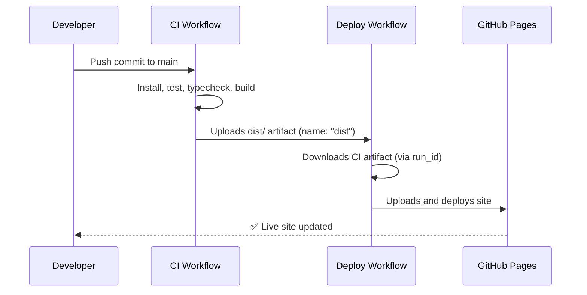

# ⚙️ GitHub Workflows Overview

> **Applies to:** Astro 5 / Starlight 0.36 / Svelte 5 / Tailwind 4 / pnpm 9  
> **Maintained by:** Dynamic Generation Inc.  
>  
> This document summarizes the automated workflows used in this repository.

---

## 🧪 Continuous Integration (`ci.yml`)

**Purpose:**  
Validate every commit on the `main` branch before deployment.  
Ensures type safety, tests, builds, and dependency security all pass.

### 🔄 Trigger

Runs automatically **on every push to `main`**  
and can also be started manually from the **Actions** tab.

### 🧱 What It Does

1. Checks out the code  
2. Installs dependencies with `pnpm install --frozen-lockfile`  
3. Runs Astro’s type checker (`pnpm astro check`)  
4. Executes Vitest unit tests (`pnpm test -- --run`)  
5. Builds the static site (`pnpm build`)  
6. Performs a moderate-level security audit (`pnpm audit --audit-level=moderate`)  
7. Uploads the built `dist/` folder as a build artifact

### 🗂 Key File

```yaml
name: ci

on:
  push:
    branches: [ main ]
  workflow_dispatch:

jobs:
  build-and-test:
    runs-on: ubuntu-latest
    steps:
      - uses: actions/checkout@v4
      - uses: pnpm/action-setup@v4
        with:
          version: 9
      - uses: actions/setup-node@v4
        with:
          node-version: 20
          cache: pnpm
      - run: pnpm install --frozen-lockfile
      - run: pnpm astro check
      - run: pnpm test -- --run
      - run: pnpm build
      - run: pnpm audit --audit-level=moderate
      - uses: actions/upload-artifact@v4
        with:
          name: dist
          path: dist
```

### ✅ Why It’s Important

Even in a **trunk-based workflow** (direct commits to `main`), this provides
an automated **quality gate** that catches:

- Broken builds  
- Type errors  
- Failing tests  
- Dependency or audit issues  

before any deployment occurs.

---

## 🚀 Deployment (`deploy.yml`)

**Purpose:**  
Publish the built site to **GitHub Pages** — either automatically after CI succeeds,  
or manually when triggered from the **Actions** tab.

### 🔄 Triggers

- **Automatically** after a successful `ci` workflow run (`workflow_run`)  
- **Manually** via the Actions tab (`workflow_dispatch`)

### 🧭 Two Execution Paths

| Path | When Used | What It Does |
|------|------------|--------------|
| 🧩 **CI Artifact** | Triggered by successful CI | Downloads the `dist` artifact from CI and deploys it |
| 🛠 **Manual Build** | Manual run via Actions tab | Rebuilds the site locally, then deploys |

### 🗂 Key File

```yaml
name: Deploy to GitHub Pages

on:
  workflow_run:
    workflows: ["ci"]
    types: [completed]
  workflow_dispatch:

concurrency:
  group: "pages"
  cancel-in-progress: true

permissions:
  contents: read
  pages: write
  id-token: write

jobs:
  use-ci-artifact:
    if: ${{ github.event_name == 'workflow_run' && github.event.workflow_run.conclusion == 'success' && github.event.workflow_run.head_branch == 'main' }}
    runs-on: ubuntu-latest
    steps:
      - uses: dawidd6/action-download-artifact@v3
        with:
          run_id: ${{ github.event.workflow_run.id }}
          name: dist
          path: ./dist
      - uses: actions/upload-pages-artifact@v3
        with:
          path: ./dist

  manual-build:
    if: ${{ github.event_name == 'workflow_dispatch' }}
    runs-on: ubuntu-latest
    steps:
      - uses: actions/checkout@v4
      - uses: withastro/action@v3

  deploy:
    needs: [use-ci-artifact, manual-build]
    if: ${{ always() && (needs.use-ci-artifact.result == 'success' || needs.manual-build.result == 'success') }}
    runs-on: ubuntu-latest
    environment:
      name: github-pages
      url: ${{ steps.deployment.outputs.page_url }}
    steps:
      - id: deployment
        uses: actions/deploy-pages@v4
```

### 🧾 Workflow Logic

1. **If CI succeeded** → download its artifact and deploy immediately.  
2. **If triggered manually** → rebuild using Astro’s official `withastro/action` before deploying.  
3. Keeps deployments **serialized** (`concurrency: pages`) to avoid collisions.

---

## 🔐 Permissions Summary

| Permission | Used For |
|-------------|-----------|
| `contents: read` | Clone source code |
| `pages: write` | Publish to GitHub Pages |
| `id-token: write` | Authenticate deploy to Pages |

---

## 🔗 Relationship Between Workflows

The two workflows — `ci.yml` and `deploy.yml` — are designed to work together in a **trunk-based** setup.  
They can also be run independently when needed.

---

### 🧩 Overview Diagram

```mermaid
graph TD
    A[Push to main] --> B[🏗 CI Workflow (ci.yml)]
    B -->|✅ Successful run| C[🚀 Deploy Workflow (deploy.yml)]
    B -->|❌ Failed| X[⚠️ Stop — Fix errors before deploy]
    C --> D[🌐 GitHub Pages Published]
    M[Manual trigger (Actions tab)] --> C
```

**Explanation:**
- Every commit to `main` runs the **CI workflow**.
- If CI **succeeds**, the **Deploy workflow** automatically triggers via `workflow_run`.
- The **manual trigger** provides a fallback for ad-hoc deployments.
- Only the deploy workflow publishes to GitHub Pages.

---

### ⚙️ Artifact Flow (When Reusing CI Build)



**Highlights:**
- The **CI build artifact (`dist/`)** is uploaded after successful tests.  
- The **Deploy workflow** reuses that artifact — it doesn’t rebuild unless manually triggered.  
- This separation keeps CI focused on **validation** and Deploy focused on **delivery**.

---

### 🧭 Manual vs Automated Paths

```mermaid
flowchart LR
    subgraph Auto [Automated Path (Preferred)]
        A1[Push to main] --> B1[ci.yml runs]
        B1 -->|Success| C1[deploy.yml auto-triggers]
        C1 --> D1[Deploys CI artifact to Pages]
    end

    subgraph Manual [Manual Path (Optional)]
        M1[Manual trigger from Actions tab] --> M2[deploy.yml builds site fresh]
        M2 --> D2[Deploys new build to Pages]
    end
```

**Notes:**
- The **automated path** runs on every trunk commit.  
- The **manual path** is available for:
  - Testing deployment changes  
  - Emergency rebuilds  
  - Artifact-free fallback deployments  

Both paths ultimately publish to **the same GitHub Pages environment**.

---

### 🔐 Permissions Overview

| Workflow | Permission | Purpose |
|-----------|-------------|----------|
| `ci.yml` | `contents: read` | Checkout code for testing/building |
| `deploy.yml` | `pages: write`, `id-token: write` | Publish to GitHub Pages |
| Both | `contents: read` | Required for repository access |

---

### 🧠 Summary

- 🧪 **CI Workflow** validates code quality and build success on each trunk commit.  
- 🚀 **Deploy Workflow** waits for CI success, then automatically publishes to GitHub Pages.  
- ⚙️ The Deploy workflow reuses CI’s artifact for speed and reliability, but can build fresh on demand.  
- 🧩 Manual deploys remain available for maintenance or debugging.  

Together, these workflows provide a **robust, zero-touch deployment pipeline** optimized for **trunk-based development**.

---

_Last updated: 2025-11-05_
