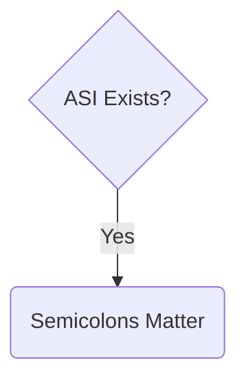

import { Aside, Badge, Card, CardGrid, Code, FileTree, Icon, LinkButton, LinkCard, Steps, TabItem, Tabs } from '@astrojs/starlight/components';
import { Image } from 'astro:assets';
import logic from './semicolons/semicolon-logic.png';

Do semicolons matter in JavaScript? That's a hot topic on par with "spaces vs. tabs". I think they do, and my reasoning is simple:

- Does JavaScript include ASI (Automatic Semicolon Insertion)?

  <Image src={logic} alt="Always Use Semicolons" />

{/* 

*/}
