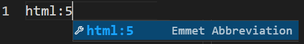
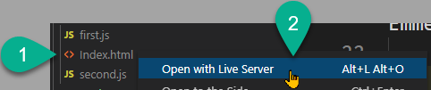

import { Aside, Badge, Code, FileTree, Icon, Steps } from '@astrojs/starlight/components';
import { Image } from 'astro:assets';

<Aside title="Work-In-Progress (WIP)" type="caution">
*See [issue 35](https://github.com/dgilleland/CPSC-1520/issues/35).*
</Aside>

<Aside type="danger" title="Remove Me!">
  This is a ***template*** file, so remove this `<Aside>` early. Also make sure to
  
  - Use the correct issue number in the WIP above.
  - Remove the Badge in the frontmatter.
</Aside>

## Discover Emmet  

This walkthrough introduces **Emmet**. It also contains two small JavaScript files: [`first.js`](./first.js) and [`second.js`](./second.js). Here, we will explore the effect of including these in the `<head>` of an HTML document that we will generate using *Emmet*.

Loading external JavaScript files is accomplished through the `<script>` element's `src` attribute. JavaScript code can be included in the HTML directly by being placed in the `<script>` element directly, but larger scripts are typically kept separate from the HTML in their own files. They standard file extension for JavaScript files is `.js`.

1. Create an `Index.html` file in this folder. Add a basic html document using [Emmet](https://code.visualstudio.com/docs/editor/emmet) by typing `html:5` and selecting the Emmet-generated expansion.

   

1. Add some basic content to the page using Emmet:

    ```
    h1{Emmet for HTML/JS/CSS}+ul>li{Item $}*3^p*3>lorem
    ```

1. In the `<head>` element of the page, add the following markup.

    ```html
    <script src="first.js"></script>
    <script src="second.js" type="module" defer></script>
    ```

1. View the page in the browser by launching it using Live Server. Right-click on the file and choose "Open with Live Server".

    

> *:+1: **TIP:** It's usually a good idea to use relative paths when linking your HTML to JavaScript files. This makes it easier to move sets of files around without having to change the internal code.*