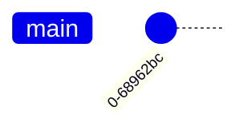

import { Aside, LinkButton, Steps } from '@astrojs/starlight/components';
import { Image } from 'astro:assets';
import versionControl from '../../../assets/undraw/undraw_version-control_eiam.svg';
import SourceCode from '@vscode/codicons/src/icons/source-control.svg'


When your lab or assignment is a GitHub repository, submitting your work is simply a matter of **commit** and **push**.

You have a couple of ways to accomplish this. You can use the `git` commands directly from the terminal (*I strongly recommend this approach*) or you can use some <abbr title="Graphical User Interface">GUI</abbr> that "wraps around" git.

<Aside>

<Image src={versionControl} alt="Frequent and Small Commits" class="float-end pl-3" width="200" />

The secret to using git is to do ***frequent*** commits. This ensures that you have more "fall-back" points if you have to switch to an earlier version of your work, and it also makes your commit history easier to read and reason about.

{/* <Image src="https://imgs.xkcd.com/comics/git_commit.png" alt="XKCD Comic" class="float-start pr-3" width="439" height="250" />

You should also work to use *meaningful commit messages*. */}
</Aside>

See the section below for guidance on [writing commit messages](#commit-messages). Additionally, check out the [Terminal Commands](/CPSC-1520/reference/1000#git/) for a summary of the various `git` commands you can use.

## From The Command-Line (Recommended)

The *TLDR* for using `git` from the command line is to follow these steps.

<Steps>

1. Make sure you are in the terminal at the *root* of your repository. *(See [terminal commands](/CPSC-1520/reference/1000#navigating-the-terminal/) for navigating folders in the terminal.)*
1. Stage whatever files you want to commit. The simplest way is to add all of the changes you have done. Use this command (and don't forget the period).

   ```ps
   git add .
   ```

1. Commit your changes with a [*meaningful* message](#commit-messages).

   ```ps
   git commit -m "Short description"
   ```

1. Push to GitHub.

   ```ps
   git push
   ```
</Steps>

## From VS Code's Built-In GUI

Visual Studio Code has a built-in GUI that offers another way to commit and submit your work. To learn more about version control with VS Code's GUI tools, see <a href="https://code.visualstudio.com/docs/sourcecontrol/overview" target="_blank">their official documentation</a>.

<Steps>
1. Click on the source code tab from the sidebar (or press <kbd>Ctrl</kbd> + <kbd>shift</kbd> + <kbd>g</kbd>).

   <Image src={SourceCode} alt="Extensions Icon" />

1. Enter a [message](#commit-messages) in the text box with the *Message* placeholder.
1. Click the **Commit** button.
1. If you haven't staged the files for committing, a dialog will open asking if you want to stage and commit directly. Click **Yes**.
1. **Sync Changes** and if a dialog pops up asking you if you want to push and pull, click **Ok**.
</Steps>

----

## Commit Messages

When you start out, you might think that it doesn't matter much what message you put for your commit. **You're wrong!** Good commit messages have several benefits to "future you" and others you work with. They also indicate a commitment to following professional standards.

Your commit message should clearly indicate the following:

- **What** changed - Not in terms of file names, but in terms of the *scope* or *effects* of your change.
- **Why** it changed - Is it a bug fix? Or is it a new feature? Is it automted tests? Perphaps you've added documentation to clarify something important. Or, if it's just some chore, like clean-up of the code.
- **Where** I can find more details - This is typically some reference to an *issue* (see <a target="_blank" href="">GitHub Issues</a>).
- **How** it fits into the bigger picture - Does it *close* an issue, or is it a "work-in-progress" (WIP)? Does it involve a breaking change?

Astute writers among you might think, "He's missing the *Who* and *When*." Actually, git automatically includes the *"Who"* with your `user.name` and `user.email` (something you first set up when you installed git). The *"When"* is also provided behind the scenes as a *timestamp* on the commit.

{/* 
Author TODO: Once the mermaid rendering is confirmed, add in a good example.

When looking over commit history (such as using `git log`), it should read like bullet points describing the 


*/}

In any case, here are some quick tips for writing good commit messages.

- Use a good prefix for the **first word** in the message to indicate the *type* of commit
- *Don't* end with punctuation
- Make it *descriptive* as a summary of what changed
- Keep it *short* (less than 50 characters is good)
- Avoid filler words

<Aside type="tip" title="Further Reading">
   

   Many people have written on the importance of writing good commit messages.
   
   Rather than repeating what they've said, here's some top articles to review.

   <LinkButton href="https://medium.com/front-end-weekly/how-to-write-good-git-commit-messages-like-a-pro-2c12f01569d9" target="_blank">How to Write Good Git Commit Messages like a pro</LinkButton>

   <LinkButton href="https://www.freecodecamp.org/news/how-to-write-better-git-commit-messages/" target="_blank">How to Write Better Git Commit Messages</LinkButton>

   <LinkButton href="https://www.pullrequest.com/blog/mastering-the-art-of-git-commit-messages/" target="_blank">Writing Effective Commit Messages in Git: Best Practices and Examples</LinkButton>
</Aside>

