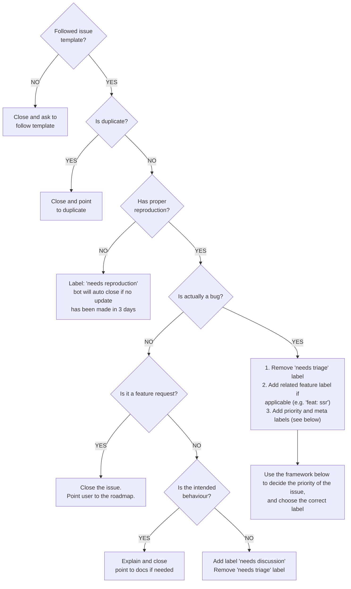

## Learning Outcome Guides

### Course Introduction (LOGs)

*At the end of this lesson, you should be able to...*

- [ ] Identify where to find the course outline, schedule, and other important documents
- [ ] Describe the marking scheme for this course
- [ ] Identify the best way to contact your instructor outside of class
- [ ] Identify the expectations of your instructor regarding attendance, participation, etc.
- [ ] Install the required software for this course (Visual Studio Code, etc.)
- [ ] Ensure you are signed up for the required services related to this course (GitHub, etc.)
- [ ] Setup and access your workbook repository for the course
- [ ] :exclamation: Explain the dangers of storing your local repositories in a cloud-synced folder (OneDrive, Dropbox, etc.)
- [ ] Identify how to locate the [official documentation for JavaScript](https://developer.mozilla.org/docs/Web/JavaScript)

### Version Control & Markdown Intro

*At the end of this lesson, you should be able to...*

- [ ] Describe what is meant by "version control"
- [ ] Identify the version control system used in this course
- [ ] List the three primary states of a file in Git
- [ ] List seven of the most common Git commands
- [ ] Configure Git to use your name and email address
- [ ] Explain the purpose of the `.gitignore` file
- [ ] Create and synchronize commits as a means of submitting your work
- [ ] Describe the purpose and basic principles of Markdown syntax
- [ ] Create notes written in Markdown format
- [ ] List four common commands used in the terminal
- [ ] Identify the keyboard shortcuts for opening the terminal inside and outside of VS Code
- [ ] Identify the keyboard shortcut to open the command palette in VS Code
- [ ] Perform basic tasks in the terminal related to navigation and version control

### More Markdown - [ ] Keeping Organized (LOGs)

*At the end of this lesson, you should be able to...*

- [ ] Create headings and subheadings in Markdown
- [ ] Create ordered and unordered lists in Markdown
- [ ] Create checkbox lists in Markdown
- [ ] Create links in Markdown
- [ ] Embed image links in Markdown
- [ ] Create tables in Markdown
- [ ] Create inline code blocks in Markdown
- [ ] Create fenced code blocks in Markdown for specific languages
- [ ] Search your repository on GitHub to find or recall information

### JavaScript in the Browser (LOGs)

*At the end of this lesson, you should be able to...*

- [ ] Access the developer tools in the Chrome browser
- [ ] Explain what is meant by stating that the Console tab in the browser's developer tools is a "REPL"
  - A REPL is a Read-Evaluate-Print-Loop. It is a programming environment that allows you to enter code, have it executed, and see the results immediately. The console in the browser's developer tools is a REPL in that we can enter JavaScript code, have it executed, and see the results immediately.
- [ ] Explain what is meant by the statement "JavaScript is a 'case-sensitive' programming language"
- [ ] Describe the terms ["keyword"](https://developer.mozilla.org/en-US/docs/Web/JavaScript/Reference/Lexical_grammar#keywords), "operator", ["identifier"](https://developer.mozilla.org/en-US/docs/Web/JavaScript/Reference/Lexical_grammar#identifiers),  "variable" and "grammar" as they relate to programming languages in general
- [ ] List the [reserved words](https://developer.mozilla.org/en-US/docs/Web/JavaScript/Reference/Lexical_grammar#reserved_words) that cannot be used as identifiers for variables, functions, classes, etc. in JavaScript
- [ ] List and categorize the different types of [Statements and Declarations](https://developer.mozilla.org/en-US/docs/Web/JavaScript/Reference/Statements) in JavaScript
- [ ] Distinguish between [statements and declarations](https://developer.mozilla.org/en-US/docs/Web/JavaScript/Reference/Statements#difference_between_statements_and_declarations) in JavaScript
- [ ] Define the acronym DOM
- [ ] Define the acronym API
- [ ] Describe the purpose of the `document` object
- [ ] Describe what the DOM API provides to JavaScript in the browser
- [ ] Demonstrate basic DOM selector methods
- [ ] Describe the terms "object", "property" and "method" as they relate to JavaScript
- [ ] Describe the purpose of the "Member Access Operator" (`.`) in JavaScript
- [ ] Demonstrate how to use the `.innerHTML` property of `HTMLElement` objects, including how to modify the DOM structure using this property
- [ ] Execute simple JavaScript statements in the console
- [ ] Demonstrate how to declare variables in the developer tools console
- [ ] Demonstrate how to assign values to variables in the developer tools console

----

### HTML/CSS Review

> ***Note: This portion is a self-study topic!** You should consider reading the MDN documentation on [HTML basics](https://developer.mozilla.org/docs/Learn/Getting_started_with_the_web/HTML_basics) and [CSS basics](https://developer.mozilla.org/docs/Learn/Getting_started_with_the_web/CSS_basics) as well as the article on [dealing with files](https://developer.mozilla.org/docs/Learn/Getting_started_with_the_web/Dealing_with_files) as a refresher on material you are expected to know **prior** to taking this course.*

*Prior to beginning this course, you should be able to...*

- Describe the purpose of the `<head>` and `<body>` elements in HTML
- List and describe the purpose of the most common elements in the `<head>` element
- List and describe the purpose of at least 15 of the most common elements in the `<body>` element
- Identify the semantic purpose of the following elements: `<header>`, `<footer>`, `<nav>`, `<section>`, `<article>`, `<aside>`, `<main>`, `<figure>`, `<figcaption>`, `
`, `
`, `<blockquote>`, `<q>`
- Identify the three primary types of CSS selectors used in a `.css` file
- Design the look and feel of a web page using CSS

### JavaScript in Your WebPage (LOGs)

*At the end of this lesson, you should be able to...*

- [ ] Create folders and files in Visual Studio Code
- [ ] Use Emmet to rapidly generate HTML code in Visual Studio Code
- [ ] Create inline JavaScript using the `<script>` tag in a web page
- [ ] Create external JavaScript files that can be referenced via a `<script>` tag
- [ ] Discuss the placement of the `<script>` tag in HTML and the concerns/issues that developers should be aware of that dictate when to place in the `<head>` vs `<body>` element
- [ ] Describe the purpose/effect of the `type` and `defer` attributes on the `<script>` element
- [ ] Describe the purpose of the `<noscript>` element
- [ ] Describe the role of web servers in the delivery and processing of web pages
- [ ] Distinguish between relative paths, root relative paths and absolute paths from the perspective of the web server
- [ ] Demonstrate how to launch a web page using the Live Server extension in VS Code
- [ ] Describe the concerns of XSS attacks and what browsers and servers do to mitigate the risk
- [ ] Describe two ways to write comments in JavaScript

### Handling Information (LOGs)

*At the end of this lesson, you should be able to...*

- [ ] Distinguish between primitive data types and object data types in JavaScript
  - Primitive data types are built into the language and represent the smallest/simplest data types for representing information.
  - Object data types are the complex types that can be build by us developers or added on top of JavaScript (like the Browser adds the `document` object in the global space)
- [ ] List the primitive data types built-in to JavaScript
- [ ] Distinguish between the `var`, `let`, and `const` keywords
- [ ] Describe what is meant by the term "Temporal dead zone" (TDZ)
- [ ] Describe what is meant by "literal values" in code
- [ ] Describe the purpose of the `typeof` operator
- [ ] Describe what is meant by the statement "JavaScript is a loosely typed language"
- [ ] Distinguish between loosely typed and strongly typed languages
- [ ] Explain the implications of JavaScript being a loosely typed language
- [ ] Describe two ways of writing string literals in JavaScript
- [ ] Describe the purpose of the `+` operator in JavaScript
- [ ] Define the term **concatenation**
- [ ] Construct strings using concatenation of string literals and variables
- [ ] Describe two ways to concatenate strings in JavaScript
- [ ] List the arithmetic operators used with numbers in JavaScript
- [ ] Explain how JavaScript's `Number` type is different from other languages such as C# or Java.
- [ ] Explain what is meant by an "expression" in JavaScript
- [ ] Describe the effects of "implicit conversion" on expressions that mix numbers and strings
- [ ] Describe how to use "explicit conversion" to convert strings to numbers
- [ ] Describe how to use "explicit conversion" to convert numbers to strings
- [ ] List five common members of the `Math` object
- [ ] List the various assignment operators in JavaScript
- [ ] Explain the difference between the `++` and `--` operators when used as a prefix vs postfix on a variable
- [ ] Explain why the increment and decrement operators cannot be used on literal numbers
- [ ] Distinguish between the special JavaScript values of `null`, `undefined`, `NaN`, and `Infinity`
- [ ] List the seven primitive types in JavaScript
- [ ] Distinguish between the technical notions of "primitive types" and "primitive values" in JavaScript

### Intro to Functions in JavaScript (LOGs)

*At the end of this lesson, you should be able to...*

- [ ] Define the term **function** in JavaScript
- [ ] Identify various built-in functions
- [ ] Use the built-in `alert()` and `prompt()` functions to interact with the user
- [ ] Distinguish between functions that return values and those that don't
- [ ] Identify what is returned when a function does not have an explicit return value.
- [ ] Explain what is meant when we say that functions are "first-class citizens" in JavaScript
- [ ] Describe how to call (invoke) functions in JavaScript
- [ ] List three methods for user interaction that are part of the global object in the browser
- [ ] List several methods that are members of the `console` object

### Creating JavaScript Functions (LOGs)

*At the end of this lesson, you should be able to...*

- [ ] Identify and distinguish the various ways to declare a function
- [ ] Describe the essential parts of a function declaration
- [ ] Describe what is meant by a **function signature**
- [ ] Describe what is meant by the term **function body**
- [ ] Define the term **block-statement**
- [ ] Define the term **parameter**
- [ ] Define the term **argument**
- [ ] Define the term **scope**
- [ ] Distinguish between local scope and global scope
- [ ] Describe how local scope "hides" a variable declared inside a function
- [ ] Define the term **lifetime**
- [ ] Distinguish between the lifetime of a variable and the scope of a variable
- [ ] Discuss some of the peculiarities of calling functions in JavaScript as compared to other languages such as C#
- [ ] Create functions that return a value
- [ ] Create functions that don't return a value
- [ ] Display a function in the developer tool's console window
- [ ] Explain the concept of "hoisting" in JavaScript
- [ ] Explain the benefits of declaring functions as constants in JavaScript
- [ ] Describe what is meant by the term "refactoring"

### Form Input and Handling Events (LOGs)

> ***Note:** If you have not yet been exposed to using HTML forms for interacting with user data, please review the article [Web forms - Working with user data](https://developer.mozilla.org/en-US/docs/Learn/Forms) on MDN.*

*At the end of this lesson, you should be able to...*

- [ ] Explain what is meant by the term "event listener"
- [ ] Explain the difference between an event and an event handler
- [ ] Explain how to hook event listeners up to elements in the DOM
- [ ] Add a function as an event listener to an element in the DOM
- [ ] Describe the event object and how to access it via event listener functions
- [ ] List the common mouse events that occur in the browser
- [ ] List five events (other than mouse events) that we can respond to in JavaScript
- [ ] Describe the event object that is passed into an event listener
- [ ] Explain the `.target` property of the event object passed into event listeners
- [ ] Describe how to check, add, and remove class names from a DOM object
- [ ] Describe how to use the `addEventListener()` method to register an event handler
- [ ] Explain the difference between the `onclick` attribute and `addEventListener()` methods
- [ ] Describe the different ways to create and use buttons in HTML
- [ ] Explain the difference between browser-initiated events and user-initiated events
- [ ] Explain what is meant by the term "event bubbling"
- [ ] Explain how to use the `preventDefault()` method to prevent the default behavior of an event
- [ ] Explain how to cancel an event using the `cancelable` property
- [ ] Identify and describe the HTML elements used for user input: `<form>`, `<input>`, `<button>`, `<label>`, `<select>`, `<option>`, `<textarea>`
- [ ] Identify and describe the various types for the `<input>` element: `text`, `password`, `checkbox`, `radio`, `submit`, `reset`, `button`, `color`, `date`, `datetime-local`, `email`, `file`, `hidden`, `image`, `month`, `number`, `range`, `search`, `tel`, `time`, `url`, `week`
- [ ] Explain the purpose of the new `<dialog>` element and how to interact with it in JavaScript

### Flow-Control - If/Else

*At the end of this topic, you should be able to...*

- Define the term "truthiness" as it relates to JavaScript
- Describe the general syntax of if-else statements in JavaScript
- Compare and contrast the `===` and `!==` operators with the `==` and `!=` operators
- List and describe the purpose of the relational and equality operators in javaScript

----

## Math + Mermaid

Here is some math:

$$
f(x) = \frac{2}{\sqrt{3}}
$$

