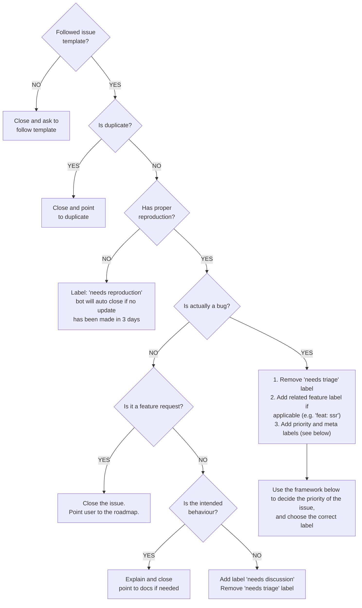

## Learning Outcome Guides

### Course Introduction (LOGs)

*At the end of this lesson, you should be able to...*

- [ ] Identify where to find the course outline, schedule, and other important documents
- [ ] Describe the marking scheme for this course
- [ ] Identify the best way to contact your instructor outside of class
- [ ] Identify the expectations of your instructor regarding attendance, participation, etc.
- [ ] Install the required software for this course (Visual Studio Code, etc.)
- [ ] Ensure you are signed up for the required services related to this course (GitHub, etc.)
- [ ] Setup and access your workbook repository for the course
- [ ] :exclamation: Explain the dangers of storing your local repositories in a cloud-synced folder (OneDrive, Dropbox, etc.)
- [ ] Identify how to locate the [official documentation for JavaScript](https://developer.mozilla.org/docs/Web/JavaScript)

### Version Control & Markdown Intro

*At the end of this lesson, you should be able to...*

- [ ] Describe what is meant by "version control"
- [ ] Identify the version control system used in this course
- [ ] List the three primary states of a file in Git
- [ ] List seven of the most common Git commands
- [ ] Configure Git to use your name and email address
- [ ] Explain the purpose of the `.gitignore` file
- [ ] Create and synchronize commits as a means of submitting your work
- [ ] Describe the purpose and basic principles of Markdown syntax
- [ ] Create notes written in Markdown format
- [ ] List four common commands used in the terminal
- [ ] Identify the keyboard shortcuts for opening the terminal inside and outside of VS Code
- [ ] Identify the keyboard shortcut to open the command palette in VS Code
- [ ] Perform basic tasks in the terminal related to navigation and version control

### More Markdown - [ ] Keeping Organized (LOGs)

*At the end of this lesson, you should be able to...*

- [ ] Create headings and subheadings in Markdown
- [ ] Create ordered and unordered lists in Markdown
- [ ] Create checkbox lists in Markdown
- [ ] Create links in Markdown
- [ ] Embed image links in Markdown
- [ ] Create tables in Markdown
- [ ] Create inline code blocks in Markdown
- [ ] Create fenced code blocks in Markdown for specific languages
- [ ] Search your repository on GitHub to find or recall information

### JavaScript in the Browser (LOGs)

*At the end of this lesson, you should be able to...*

- [ ] Access the developer tools in the Chrome browser
- [ ] Explain what is meant by stating that the Console tab in the browser's developer tools is a "REPL"
  - A REPL is a Read-Evaluate-Print-Loop. It is a programming environment that allows you to enter code, have it executed, and see the results immediately. The console in the browser's developer tools is a REPL in that we can enter JavaScript code, have it executed, and see the results immediately.
- [ ] Explain what is meant by the statement "JavaScript is a 'case-sensitive' programming language"
- [ ] Describe the terms ["keyword"](https://developer.mozilla.org/en-US/docs/Web/JavaScript/Reference/Lexical_grammar#keywords), "operator", ["identifier"](https://developer.mozilla.org/en-US/docs/Web/JavaScript/Reference/Lexical_grammar#identifiers),  "variable" and "grammar" as they relate to programming languages in general
- [ ] List the [reserved words](https://developer.mozilla.org/en-US/docs/Web/JavaScript/Reference/Lexical_grammar#reserved_words) that cannot be used as identifiers for variables, functions, classes, etc. in JavaScript
- [ ] List and categorize the different types of [Statements and Declarations](https://developer.mozilla.org/en-US/docs/Web/JavaScript/Reference/Statements) in JavaScript
- [ ] Distinguish between [statements and declarations](https://developer.mozilla.org/en-US/docs/Web/JavaScript/Reference/Statements#difference_between_statements_and_declarations) in JavaScript
- [ ] Define the acronym DOM
- [ ] Define the acronym API
- [ ] Describe the purpose of the `document` object
- [ ] Describe what the DOM API provides to JavaScript in the browser
- [ ] Demonstrate basic DOM selector methods
- [ ] Describe the terms "object", "property" and "method" as they relate to JavaScript
- [ ] Describe the purpose of the "Member Access Operator" (`.`) in JavaScript
- [ ] Demonstrate how to use the `.innerHTML` property of `HTMLElement` objects, including how to modify the DOM structure using this property
- [ ] Execute simple JavaScript statements in the console
- [ ] Demonstrate how to declare variables in the developer tools console
- [ ] Demonstrate how to assign values to variables in the developer tools console


----

### HTML/CSS Review

> ***Note: This portion is a self-study topic!** You should consider reading the MDN documentation on [HTML basics](https://developer.mozilla.org/docs/Learn/Getting_started_with_the_web/HTML_basics) and [CSS basics](https://developer.mozilla.org/docs/Learn/Getting_started_with_the_web/CSS_basics) as well as the article on [dealing with files](https://developer.mozilla.org/docs/Learn/Getting_started_with_the_web/Dealing_with_files) as a refresher on material you are expected to know **prior** to taking this course.*

*Prior to beginning this course, you should be able to...*

- Describe the purpose of the `<head>` and `<body>` elements in HTML
- List and describe the purpose of the most common elements in the `<head>` element
- List and describe the purpose of at least 15 of the most common elements in the `<body>` element
- Identify the semantic purpose of the following elements: `<header>`, `<footer>`, `<nav>`, `<section>`, `<article>`, `<aside>`, `<main>`, `<figure>`, `<figcaption>`, `<summary>`, `<details>`, `<blockquote>`, `<q>`
- Identify the three primary types of CSS selectors used in a `.css` file
- Design the look and feel of a web page using CSS


### JavaScript in Your WebPage (LOGs)

*At the end of this lesson, you should be able to...*

- [ ] Create folders and files in Visual Studio Code
- [ ] Use Emmet to rapidly generate HTML code in Visual Studio Code
- [ ] Create inline JavaScript using the `<script>` tag in a web page
- [ ] Create external JavaScript files that can be referenced via a `<script>` tag
- [ ] Discuss the placement of the `<script>` tag in HTML and the concerns/issues that developers should be aware of that dictate when to place in the `<head>` vs `<body>` element
- [ ] Describe the purpose/effect of the `type` and `defer` attributes on the `<script>` element
- [ ] Describe the purpose of the `<noscript>` element
- [ ] Describe the role of web servers in the delivery and processing of web pages
- [ ] Distinguish between relative paths, root relative paths and absolute paths from the perspective of the web server
- [ ] Demonstrate how to launch a web page using the Live Server extension in VS Code
- [ ] Describe the concerns of XSS attacks and what browsers and servers do to mitigate the risk
- [ ] Describe two ways to write comments in JavaScript


### Handling Information (LOGs)

*At the end of this lesson, you should be able to...*

- [ ] Distinguish between primitive data types and object data types in JavaScript
  - Primitive data types are built into the language and represent the smallest/simplest data types for representing information.
  - Object data types are the complex types that can be build by us developers or added on top of JavaScript (like the Browser adds the `document` object in the global space)
- [ ] List the primitive data types built-in to JavaScript
- [ ] Distinguish between the `var`, `let`, and `const` keywords
- [ ] Describe what is meant by the term "Temporal dead zone" (TDZ)
- [ ] Describe what is meant by "literal values" in code
- [ ] Describe the purpose of the `typeof` operator
- [ ] Describe what is meant by the statement "JavaScript is a loosely typed language"
- [ ] Distinguish between loosely typed and strongly typed languages
- [ ] Explain the implications of JavaScript being a loosely typed language
- [ ] Describe two ways of writing string literals in JavaScript
- [ ] Describe the purpose of the `+` operator in JavaScript
- [ ] Define the term **concatenation**
- [ ] Construct strings using concatenation of string literals and variables
- [ ] Describe two ways to concatenate strings in JavaScript
- [ ] List the arithmetic operators used with numbers in JavaScript
- [ ] Explain how JavaScript's `Number` type is different from other languages such as C# or Java.
- [ ] Explain what is meant by an "expression" in JavaScript
- [ ] Describe the effects of "implicit conversion" on expressions that mix numbers and strings
- [ ] Describe how to use "explicit conversion" to convert strings to numbers
- [ ] Describe how to use "explicit conversion" to convert numbers to strings
- [ ] List five common members of the `Math` object
- [ ] List the various assignment operators in JavaScript
- [ ] Explain the difference between the `++` and `--` operators when used as a prefix vs postfix on a variable
- [ ] Explain why the increment and decrement operators cannot be used on literal numbers
- [ ] Distinguish between the special JavaScript values of `null`, `undefined`, `NaN`, and `Infinity`
- [ ] List the seven primitive types in JavaScript
- [ ] Distinguish between the technical notions of "primitive types" and "primitive values" in JavaScript

### Intro to Functions in JavaScript (LOGs)

*At the end of this lesson, you should be able to...*

- [ ] Define the term **function** in JavaScript
- [ ] Identify various built-in functions
- [ ] Use the built-in `alert()` and `prompt()` functions to interact with the user
- [ ] Distinguish between functions that return values and those that don't
- [ ] Identify what is returned when a function does not have an explicit return value.
- [ ] Explain what is meant when we say that functions are "first-class citizens" in JavaScript
- [ ] Describe how to call (invoke) functions in JavaScript
- [ ] List three methods for user interaction that are part of the global object in the browser
- [ ] List several methods that are members of the `console` object

### Creating JavaScript Functions (LOGs)

*At the end of this lesson, you should be able to...*

- [ ] Identify and distinguish the various ways to declare a function
- [ ] Describe the essential parts of a function declaration
- [ ] Describe what is meant by a **function signature**
- [ ] Describe what is meant by the term **function body**
- [ ] Define the term **block-statement**
- [ ] Define the term **parameter**
- [ ] Define the term **argument**
- [ ] Define the term **scope**
- [ ] Distinguish between local scope and global scope
- [ ] Describe how local scope "hides" a variable declared inside a function
- [ ] Define the term **lifetime**
- [ ] Distinguish between the lifetime of a variable and the scope of a variable
- [ ] Discuss some of the peculiarities of calling functions in JavaScript as compared to other languages such as C#
- [ ] Create functions that return a value
- [ ] Create functions that don't return a value
- [ ] Display a function in the developer tool's console window
- [ ] Explain the concept of "hoisting" in JavaScript
- [ ] Explain the benefits of declaring functions as constants in JavaScript
- [ ] Describe what is meant by the term "refactoring"

### Form Input and Handling Events (LOGs)

> ***Note:** If you have not yet been exposed to using HTML forms for interacting with user data, please review the article [Web forms - Working with user data](https://developer.mozilla.org/en-US/docs/Learn/Forms) on MDN.*

*At the end of this lesson, you should be able to...*

- [ ] Explain what is meant by the term "event listener"
- [ ] Explain the difference between an event and an event handler
- [ ] Explain how to hook event listeners up to elements in the DOM
- [ ] Add a function as an event listener to an element in the DOM
- [ ] Describe the event object and how to access it via event listener functions
- [ ] List the common mouse events that occur in the browser
- [ ] List five events (other than mouse events) that we can respond to in JavaScript
- [ ] Describe the event object that is passed into an event listener
- [ ] Explain the `.target` property of the event object passed into event listeners
- [ ] Describe how to check, add, and remove class names from a DOM object
- [ ] Describe how to use the `addEventListener()` method to register an event handler
- [ ] Explain the difference between the `onclick` attribute and `addEventListener()` methods
- [ ] Describe the different ways to create and use buttons in HTML
- [ ] Explain the difference between browser-initiated events and user-initiated events
- [ ] Explain what is meant by the term "event bubbling"
- [ ] Explain how to use the `preventDefault()` method to prevent the default behavior of an event
- [ ] Explain how to cancel an event using the `cancelable` property
- [ ] Identify and describe the HTML elements used for user input: `<form>`, `<input>`, `<button>`, `<label>`, `<select>`, `<option>`, `<textarea>`
- [ ] Identify and describe the various types for the `<input>` element: `text`, `password`, `checkbox`, `radio`, `submit`, `reset`, `button`, `color`, `date`, `datetime-local`, `email`, `file`, `hidden`, `image`, `month`, `number`, `range`, `search`, `tel`, `time`, `url`, `week`
- [ ] Explain the purpose of the new `<dialog>` element and how to interact with it in JavaScript


### Foundations of Procedural Programming

- Name and describe the characteristics of the flow control structure that is present in all programming languages.
  - Simple Sequence - Instructions for the computer must be performed in order, one after the other.
- Draw a diagram to illustrate sequential instructions.

### Flow-Control - If/Else

*At the end of this topic, you should be able to...*

- Define the term "truthiness" as it relates to JavaScript
- Describe the general syntax of if-else statements in JavaScript
- Compare and contrast the `===` and `!==` operators with the `==` and `!=` operators
- List and describe the purpose of the relational and equality operators in javaScript


> Begin `<C#>` - from [The Book](https://programming-0101.github.io/TheBook/About/log-summary.html#topic-f-if-else-structures)

- Describe and draw a diagram of the If-Then-Else logical structure
  - ...
- Identify the programming statement that corresponds to the If-Then-Else logical structure.
  - The if-else statement is used for If-Then-Else logical structures in C#.
- Translate If-Then-Else structures into code.
  - Demonstrate your ability to meet this learning outcome guide by completing the related assignments.
- Describe what is meant by a "conditional expression"
  - A conditional expression is any expression which results in a Boolean (true/false) value.
- List the operator precedence for mixing logical, arithmetic, and relational operations
  - Logical Not (!), Arithmetic, Relational, Logical And/Or
- List the relational operators
  - `>`, `>=`, `==`, `===`, `!=`, `!==`, `<=`, `<`
  - Greater Than (`>`)
  - Greater Than or Equal To (`>=`)
  - Is Equal To (`==`)
  - Is Strictly Equal To (`===`)
  - Is Not Equal To (`!=`)
  - Is Not Strictly Equal To (`!==`)
  - Less Than or Equal To (`<=`)
  - Less Than (`<`)
- List the logical operators
  - `&&`, `||`, `!`
  - And (`&&`)
  - Or (`||`)
  - Not (`!`)
- Use relational, logical, and arithmetic operators to construct conditional expressions
  - Demonstrate your ability to meet this learning outcome guide by completing the related assignments.
- Demonstrate an understanding of operator precedence in conditional expressions
  - Demonstrate your ability to meet this learning outcome guide by completing the related assignments.
- Use statement blocks to allow nesting program statements into control structures
  - Demonstrate your ability to meet this learning outcome guide by completing the related assignments.
- Define the term "boundary condition" as it relates to if-else statements and testing
  - A "boundary condition" is also known as a "fence-post condition".
  - The "boundary" is the border of a range of values that are regarded as "acceptable" for some variable. For example, if a particular variable named percent is to represent a range of values from zero through 100 inclusive, then the "boundary" values are zero and 100.
  - A boundary condition, then, is a test or comparison that is made against some boundary values. For example,

  ```cs
    if(percent >= 0 && percent <= 100)
    {
        // code to perform if true
    }
    else
    {
        // code to perform if false
    }
  ```

- Identify the correct way to compare or check the contents of strings in conditional expressions
  - The proper way to compare String values is to use the .Equals(), .CompareTo() and .IsNullOrEmpty() methods.
  - Generally, the relational operators (==, <, etc) should not be used directly on string values.
- List and describe the commonly used fields and methods of the String class that would be used in if-else statements
  - `.Equals(String)` - returns a Boolean, true or false, as to whether the two strings are or are not equal.
  - `.Equals(String, StringComparison)` - returns a Boolean, true or false, as to whether the two strings are or are not equal, according to the value of the StringComparison argument (which includes values to ignore any differences in upper and lower case).
  - `.CompareTo(String anotherString)` - compares two strings "lexographically" (that is, alphabetically) and returns either
    1. a zero if they are the same, or
    1. a negative number if anotherString is greater than the first string, or
    1. a positive number if anotherString is less than the first string
  - `.IsNullOrEmpty(string)` - returns true if the string is an empty string (""), false if it is not an empty string.
  - `.IsNullOrWhiteSpace(string)` - (only in .NET 4.0 and higher) returns true if the string is null, an empty string (""), or all "whitespace" (tab, newline) characters; false if it is not.
  - `.Length` - returns the total number of characters in the string.

## Topic G - Raising Exceptions

### General Programming Concepts and Terms

- Describe how object-oriented programs run.
  - A computer program is a set of instructions for manipulating information.
  - Every computer program has a single starting (or entry) point called the Main method. The main method is responsible to "run" (or "execute) the program, and when the main method exits, the program closes and stops "running". The length of time that a program is running is called its "lifetime". As a program runs, it executes instructions in the program's code, one at a time; this is called the "flow of execution".
  - During the lifetime of a program, the main method creates objects and calls methods on those objects. Each method is basically a set of instructions to be executed. Those methods can, in turn, create other objects and call other methods.
  - Whenever a method is called, the operating system keeps track of which method is calling another method through something known as a "call stack".

- Describe what is meant by a "call stack".
  - A call stack is a mechanism to track which method is calling another method while the program is running. Call stacks allow the computer to know where to "return to" when a method exits.
  - At any given point during the program's execution, the method that is currently executing is referred to as the "called method". When the called method exits, it returns control back to the "calling method", thereby allowing the calling method to continue its own execution.
  - Whenever a method calls another method, the "calling method" pauses and waits for the "called method" to finish; once the called method returns, the calling method will resume executing its own code.

- Define the term "Exception"
  - An exception is a message of some run-time error that has occurred in a program. Exceptions interrupt the normal flow of execution in methods, forcing the method to immediately exit. Methods generate exceptions by using the "throw" statement. Any method may generate an exception (including constructors).
  - The throw statement exits the method by sending back an object (called an "Exception Object", or simply an "Exception") that can be used to identify the kind of error that has occurred. The calling method then has the opportunity to deal with (or "handle") the error; if the calling method does not handle the error, then the exception continues to go back through the call stack until it finds a method that will handle the exception.
  - If none of the methods on the call stack handle the exception that was thrown, control is eventually returned to the main method. If the main method does not handle the exception, then the exception is sent to the operating system. At that point, the operating system shuts down the program in what is called an "abnormal program termination".

- Describe what is meant by the phrase "raising (or throwing) an exception"
  - To "raise an exception" (or "throw an exception") is to force a method to exit prematurely by sending back an "Exception object".

- Describe the role that exceptions play in a computer program
  - An exception is an interruption in the normal flow of execution in a method; exceptions force the method to immediately exit.
  - Exceptions provide a way for methods (including constructors) to report errors to whatever code that is calling the method. These errors are usually (but not always) due to invalid information passed into the methods via the parameters. Through the use of exceptions, methods can perform validation on their parameters and report any errors that might prevent the method from being able to perform its task.

- Identify the three most commonly used Exception types used in this course.
  - .NET Framework
    - **ArgumentException** - Typically thrown whenever an argument passed to a parameter does not have an "acceptable" value.
      
      For example, if a method has a parameter called "percent", it might perform validation to ensure that the value is not less than zero or greater than 100. If the value is not valid, it may be appropriate to throw an ArgumentException.
    - **ArgumentNullException** - Typically thrown whenever an object is checked for and found to be "null".

      (ArgumentNullException will be discussed in the topic on Enumerations and Composition.)
    - **Exception** - This represents a general exception, and can be used whenever there is no other suitable exception type.

### OOP Basics

- Explain why methods (including constructors) should perform validation of their parameter values
  - One of the principles of object-oriented design is that objects must be responsible for ensuring that their fields have correct values. This is known as ensuring a "valid state" for an object.
  - Typically, the values that are stored in fields come in through the parameters of a constructor or a method. Because objects are responsible for ensuring a valid state, the class' methods must check all parameters that might allow "invalid" data to be passed in.

- Explain the significance of raising an exception in the constructor
  - If an exception is thrown from a constructor (or passes through it on its way up the call stack), the object's construction is interrupted. Because the construction of that object is interrupted, the object does not get instantiated.

- Use exceptions as part of the validation of parameter values in methods and constructors.
  - Demonstrate your ability to meet this learning outcome guide by completing the related assignments.

- Explain why property setters are a good place for throwing exceptions.
  - Generally speaking, the only method that should directly modify a field is the property setter associated with the field. Because of this principle, the property setter is the ideal place to perform validation and to throw exceptions. When validation takes place here, it eliminates the need for duplicating the validation elsewhere in the class.
  - Validating input and throwing exceptions from within setters is a good way to follow the ***DRY*** principle: "**D**on't **R**epeat **Y**ourself".

- Identify when constructors should throw exceptions directly.
  - Whenever a field has a property setter that performs validation, the constructor should use that setter to store information in the field. If no property setter is available to process the parameter values sent through the constructor, then the constructor should perform its own validation on those parameters.

## Topic H - Case Structures

#### General Programming Concepts and Terms

- Describe the syntax of the switch statement
  - Demonstrate your ability to meet this learning outcome guide by completing the related assignments.

- Discuss the limitations of the switch statement in C# and the available alternatives for the times that we can't use a switch statement
  - Switch statements only work with integral data types (such as char and int).
  - The individual case values must be constants; variable expressions are not allowed for the matching cases.
  - Switch statements only check for exact matches (meaning that there is an implied "is-equal-to" comparison); other relational comparisons, such as greater than or less than, are not allowed.
  - When it is not possible to use switch statements, case structures can be written up as nested and/or stacked if-else structures to make use of the if-else statement.

## Topic I Enumerations and Composition

### General Programming Concepts and Terms

- Define the term Enumeration
  - An enumeration is a simple program-defined data type with a limited set of possible values. Enumerations represent information that is "conceptual" in nature (as opposed to information that is textual, numeric, or complex).
  For example, a coin has two sides that are commonly referred to as HEADS and TAILS. Rather than creating two constant strings with the values "Heads" and "Tails" and a String variable called FaceShowing, you can use an enumeration.
  - There are two parts to enumerations:
  a. The name of the enumeration, which is the name of the new data type; this is sometimes referred to as the "enumerated data type".
  b. A set of enumerated values, which represent all of the possible values for a variable of that enumerated type. These values act like "constants" that can be used to distinguish different "states" for the conceptual data.

- List the benefits of using enumerations
  - **Type Safety** - Enumerations allow a program to be "type safe", meaning that there is less likelihood of creating logical errors or other mistakes through the use of constants or literal values.
  - **Code Readability** - Enumerations make code more readable than constants or literal values (like integers).
  - **Compatibility with Switch Statements** - Enumerations are compatible with switch statements, making them a great option for describing distinct values for matching against different cases. Because enumerations are like constants, and are treated as integral data types by the compiler, they are often the best choice when working with case structures.
  - **Useful as Flags** - Because the programmer can associate specific integer values to the enumerated values, it is possible to use an enumerated data type to create complex "flags" for representing distinct "states" that can be combined together.
  For example, if you had an enumerated type such as the following, you could combine two states together in a variable's value to represent distinct but compatible states, such as `ACTIVE` and `MEDIUM_PRIORITY`.

    ```csharp
    enum Status
    {
        INACTIVE = 0
        ACTIVE = 1
        LOW_PRIORITY = 2
        MEDIUM_PRIORITY = 4
        HIGH_PRIORITY = 8
    }
    ```

- Describe where and when enumerations are used
  - Enumerations are used wherever a clearly defined set of values can be "classified" and used to represent conceptual information.
  - Enumerations should be used whenever you might be inclined to use a set of two or more constants to represent distinct "states" or values for comparing against a variable.

    For example, if you want to represent the two sides of a coin, it is better to use an enumeration for the coin's HEADS and TAILS sides, rather than declaring some String or integer constants. The problem with using strings or simple integers to represent possible coin faces is that any variable that is defined as a string or integer can have values that won't match either of the declared constants, as in this example:

    ```csharp
    const string Heads = "Heads";
    const string Tails = "Tails";
    // There is nothing preventing "invalid" values for the following coin face...
    string theFaceShowingOnTheCoin = "Sailboat";
    ```

    An enumerated type called `CoinFace` with the values `HEADS` and `TAILS` is better, because any variable declared of type `CoinFace` can only have the values defined in the enumeration.

    ```csharp
    // The only other possible value that could be assigned is
    // CoinFace.TAILS
    CoinFace theFaceShowingOnTheCoin = CoinFace.HEADS;
    ```

- Compare and contrast enumerations and classes
  - Enumerations and classes both define new data types that can be used by our program to represent custom data. However, while classes are useful in describing complex data types (that is, data types with assorted fields and that can perform various tasks), enumerations are only used to create new data types that are simple in nature. Enumerations only define a set of possible values, and each variable defined by an enumeration can only hold one of those possible values at any given time; there is no inner complexity to enumerations, as there is with classes.

- Use enumerations to define simple data types that are conceptual in nature and that have a limited set of possible "values"
  - Demonstrate your ability to meet this learning outcome guide by completing the related assignments.

### OOP Basics

- Describe the idea of Composition
  - Composition refers to the situation where one or more of the fields in a class are objects. All classes are capable of having objects as fields, rather than just using the simple primitive types that come with the language.
  For example, if a class called Address represents some mailing address, another class, such as Student, Company, School, or Business, could have a field whose data type is Address.

- List the benefits of Composition
  - Composition is an aspect of modern programming languages that makes it possible to create new data types (classes) of ever increasing complexity.
  - Composition also makes it possible to get better code re-use, because classes can be more distinct, rather than overlapping. For example, both Students and Employees can have Addresses, so it is not necessary to code individual fields in the Student and Employee class for each part of an address; rather, a common type (called Address) can be shared by both classes.

    ```csharp
    public class Employee {
        // ... other fields, followed by these Address fields:
        public string street { get; set; }
        public string city { get; set; }
        public string province { get; set; }
        // ... etc.
    }

    public class Student {
        // ... other fields, followed by these Address fields:
        public string street { get; set; }
        public string city { get; set; }
        public string province { get; set; }
        // ... etc.
    }
    ```

    These could be coded like this:

    ```csharp
    public class Employee {
        // ... other fields, followed by these Address fields:
        public Address mailingAddress { get; set; }
    }

    class Student {
        // ... other fields, followed by these Address fields:
        public Address homeAddress { get; set; }
    }
    ```

  - *advanced benefit* - Composition promotes the "Has-A" approach to designing objects rather than the "Is-A" design approach that makes use of inheritance. This "Has-A" approach gives programmers more flexibility in their coding and promotes the use of Design Patterns.

## Topic J - Looping Structures

### General Programming Concepts and Terms

- Identify the C# statements that correspond to Do-While and Do-Until logical structures
  - TBA

- Translate Do-While structures into code
  - TBA

- Translate Do-Until structures into code
  - TBA

- Identify and distinguish the parts of the for statement in code
  - TBA

- Describe the common situations in which the for statement is used
  - TBA

- Demonstrate how the various looping statements can be interchanged with slight alterations of the logical structures to maintain the overall logic of a given routine.
  - TBA

## Topic K - Looping and Collections

### OOP Basics

- Define the term Generics as used in C# and give an example
  - TBA

### General Programming Concepts and Terms

- Describe what is meant by a "collection" class and give an example
  - TBA

- List and describe the common methods of collection classes such as the `List<T>`
  - TBA

- Identify the parts of the foreach statement
  - TBA

- Describe the common situations in which the foreach statement is typically used
  - TBA

- Identify the major benefit of using Generics
  - Type Safety –

- List the major benefits of using collections instead of arrays
  - Collections such as `List<T>` can grow in capacity whenever items are added
  - Collections such as `List<T>` do not need special management of the boundaries (such as the index of the upper limit of an array)
  - Collections provide simple methods for quick adding and removing of "elements"

## Topic L - Arrays - Not Sorted

### General Programming Concepts and Terms

- Describe what makes an array different from other collections in C#
  - The programmer is responsible to manage the boundaries of the array when manipulating the array's contents.
  - Arrays do not automatically “re-size” when “adding” or “removing” elements; the size of the array is fixed at the time the array is created.

- Describe the situations in which arrays are preferable over the use of collections
  - Arrays are preferred whenever multi-dimensional data is required (such as 2D, 3D, or n-dimensional data is needed)
  - Arrays are sometimes preferred whenever the size (number of elements) is unlikely to change and/or whenever the array is based on a primitive data type or an enumeration.


> End `</C#>`

----

## Math + Mermaid

Here is some math:

$$
f(x) = \frac{2}{\sqrt{3}}
$$


